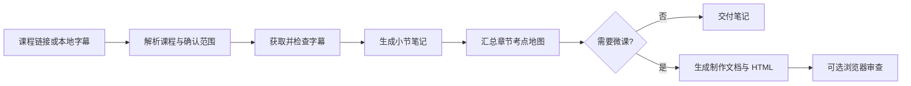

<h1 align="center">Course Notes</h1>

<h3 align="center">让 AI 把分 P 网课整理成可复习、可追溯的章节笔记</h3>

<p align="center">
  字幕获取 · ASR 纠错 · 考点整理 · 章节地图 · HTML 交互微课
</p>

<p align="center">
  <a href="#快速开始"><strong>快速开始</strong></a>
  &nbsp;&bull;&nbsp;
  <a href="#功能"><strong>功能</strong></a>
  &nbsp;&bull;&nbsp;
  <a href="#工作流"><strong>工作流</strong></a>
  &nbsp;&bull;&nbsp;
  <a href="#依赖"><strong>依赖</strong></a>
</p>

<p align="center">
  
  
  
  
</p>

---

## Course Notes

Course Notes 面向在线课程整理场景。给出 B 站 BV 号、视频链接或本地字幕后，AI 可以按章节获取字幕、修正上下文明确的 ASR 错误，并产出小节笔记与全章考点地图。

需要更直观的复习材料时，还可以为每个小节生成制作简报、口播脚本、逐秒分镜和单文件 HTML 交互微课。

```text
/course-notes BV1xxxxxxxxx 第三章
```

或生成配套微课：

```text
/course-notes BV1xxxxxxxxx P20-32 --video
```

## 功能

- **课程结构解析**：读取 B 站分 P 标题，按章节名称或 P 区间确定处理范围。
- **字幕优先处理**：下载 AI 中文字幕并保留时间戳，支持直接使用本地字幕。
- **上下文 ASR 纠错**：结合课程语境修正明确的同音字错误，对歧义内容保留原文并标记待核实。
- **结构化学习笔记**：整理核心概念、公式条件、算法实现、复杂度、易错点与典型考法。
- **来源可追溯**：关键结论尽量保留 `P + 时间戳` 定位，区分课程原意、补充解释与待核实内容。
- **章节考点地图**：生成知识树、前置依赖、复习优先级、公式清单和小节索引。
- **可选微课资产**：生成 `BRIEF`、`TREATMENT`、`SCRIPT`、`STORYBOARD` 与 HTML 播放器。
- **五种视觉主题**：提供 cyberpunk、academic、brutalist、glassmorphism 和 classic_blue。
- **断点续作**：按小节记录状态，保留成功结果，仅重做缺失或失败项。

## 工作流



Course Notes 默认优先完成笔记与章节总览。只有在使用 `--video` 或明确要求时，才继续生成微课资产。

## 快速开始

### 1. 准备环境

确认 Python 版本：

```bash
python --version
```

安装字幕下载工具：

```bash
python -m pip install --upgrade yt-dlp
```

确认命令可用：

```bash
yt-dlp --version
```

### 2. 发起任务

按章节整理：

```text
/course-notes https://www.bilibili.com/video/BVxxxxxxxxxx 第三章
```

按 P 区间整理：

```text
/course-notes BVxxxxxxxxxx P20-32
```

生成笔记和交互微课：

```text
/course-notes BVxxxxxxxxxx P20-32 --video
```

使用本地字幕：

```text
/course-notes D:/courses/data-structure/subtitles 第三章
```

如果章节名称无法唯一映射到分 P，AI 会先展示匹配结果并请求确认；明确给出 P 区间时可直接开始。

### 3. 查看结果

典型交付结构：

```text
数据结构课程/
└── 第三章_栈队列和数组/
    ├── 00_第三章总览与考点地图.md
    ├── references/
    │   └── STYLE_PROFILE.md
    └── 3.1.1_栈的基本概念/
        ├── 3.1.1_栈的基本概念.md
        ├── 3.1.1_栈的基本概念_讲解视频演示.html
        ├── BRIEF.md
        ├── TREATMENT.md
        ├── SCRIPT.md
        └── STORYBOARD.md
```

每门课程使用独立的课程目录，章节目录统一放在课程目录下。课程名称优先采用课程页标题，也可由用户指定。仅生成笔记时，每个小节只包含 Markdown 笔记，章节根目录包含总览与索引。

## 依赖

### 必需

| 依赖 | 用途 | 要求 |
|---|---|---|
| Python | 运行字幕、画像与微课生成脚本 | 3.10 或更高版本 |
| yt-dlp | 获取 B 站字幕 | 可从终端直接调用 |
| 支持技能的 AI 编程代理 | 执行工作流、生成并汇总笔记 | 需要文件读写与命令执行能力 |

项目脚本的 Python 部分仅使用标准库；`yt-dlp` 是字幕获取阶段使用的外部命令。

### 可选：浏览器审查与 Cookie 导出

生成 HTML 后如需自动检查控制台错误、页面溢出并保存截图，需要 Node.js 和 Playwright CLI：

```bash
npm install -g @playwright/cli@latest
playwright-cli --help
```

Playwright CLI 还用于从**已有登录会话**导出 Netscape 格式 Cookie。Cookie 只在本地使用，不应提交到 Git 仓库或复制到笔记中。

如果不需要 HTML 浏览器审查，也不需要通过浏览器会话导出 Cookie，可以不安装这组依赖。

## Cookie 与字幕

部分 B 站字幕可能需要登录 Cookie。Course Notes 会依次尝试：

1. 用户显式提供的 Netscape `cookies.txt`；
2. 上次成功使用的 Cookie 路径；
3. 工作区 `tmp/.playwright-cli/` 等本地候选位置。

Cookie 缺失或字幕为空时，不会根据标题猜测课程内容。可能的原因包括：

- 视频没有字幕；
- 字幕轨道不可用；
- Cookie 已失效；
- 网络或地区访问受限。

此时可以提供新的 Cookie 文件，或直接提供合法获取的字幕/转写稿继续处理。

## 笔记格式

每节笔记默认包含：

```markdown
# <小节编号> <小节名称>

## 一、本节在408中的定位
## 二、核心知识点
## 三、代码实现与核心算法
## 四、易错点与高频陷阱
## 五、408典型考法与解题技巧
## 六、30秒速记
```

默认模板面向 408 计算机考研。用户指定其他科目时，会替换考试定位和内容结构，不会强行套用 408 考情。

## 微课输出

启用 `--video` 后，每个小节可生成：

| 文件 | 内容 |
|---|---|
| `BRIEF.md` | 学习目标、受众、来源与不可遗漏的事实 |
| `TREATMENT.md` | 视觉方案、画面层次、交互和降级方式 |
| `SCRIPT.md` | 可朗读的口播、公式读法、停顿与画面提示 |
| `STORYBOARD.md` | 连续场景、预计时间、画面状态与对应台词 |
| `*_讲解视频演示.html` | 可直接在现代浏览器中打开的交互微课 |

这些产物用于内容讲解、演示和后续制作。HTML 与制作文档不等同于 MP4 视频文件。

## 设计原则

1. **准确优先于完整**：字幕不足时标记缺失，不编造课程内容。
2. **来源优先于断言**：考查频率、分值和真题年份需要可靠依据。
3. **条件优先于口诀**：公式、结论和速记方法必须保留适用边界。
4. **理解优先于装饰**：动画服务于状态变化与算法推演，不用视觉效果掩盖逻辑。
5. **小节独立交付**：每个任务只写自己的目录，失败时可单独恢复。
6. **保护已有文件**：覆盖旧笔记或微课资产前先确认范围。

## 项目结构

```text
.
├── SKILL.md                         # 工作流、质量标准与执行约定
├── README.md                        # 项目说明
├── references/
│   └── STYLE_PROFILE.md             # 微课风格规划模板
└── scripts/
    ├── fetch_subs.py                # 分 P 列表、字幕下载与文本转换
    ├── export_cookies.py            # 从已有登录会话导出 Cookie
    ├── init_profile.py              # 可选学习画像与主题偏好
    ├── generate_hypit_lesson.py     # 制作文档与 HTML 生成
    └── audit_player.py              # 可选浏览器审查与截图
```

## 使用提示

- 第一次处理一门课程时，建议先选 1–2 个小节确认笔记风格，再扩大范围。
- 长章节建议分批处理，减少上下文压力，并方便定位失败项。
- ASR 文本中的专业术语可能存在误识别；歧义内容应回看原片或人工确认。
- 微课生成器包含预置交互模板，不适合所有学科。没有匹配的可视化模型时，应优先使用静态步骤图或分镜。
- 浏览器审查覆盖控制台异常、部分布局边界和截图，不代表所有交互、设备与无障碍场景均已验证。

## 致谢

本项目的视听工作流与视频理解思路受到以下优秀开源项目启发：

- [hypit-ai/hypit](https://github.com/hypit-ai/hypit) — 面向 AI Agent 的视频创作语言与工作流。
- [bradautomates/claude-video](https://github.com/bradautomates/claude-video) — 让 AI Agent 基于字幕、音频和视频帧理解视频内容。

感谢这些项目及其贡献者为 Agent 驱动的视频创作与理解生态所做的工作。
