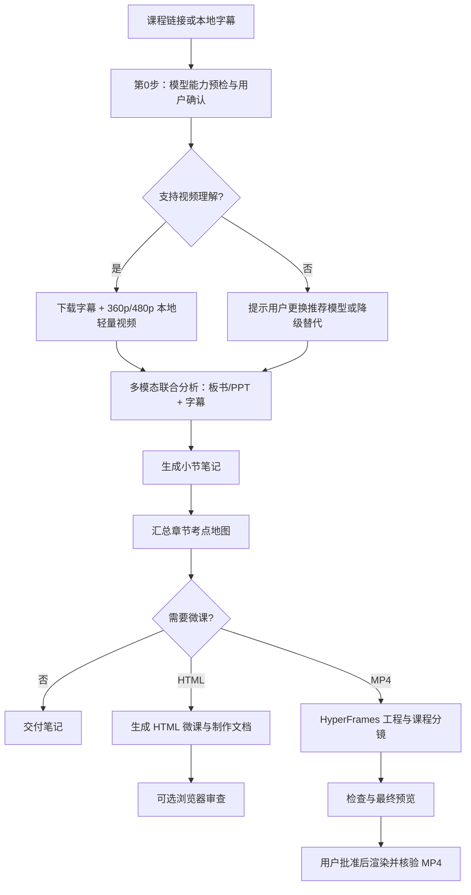

<h1 align="center">Course Notes</h1>

<h3 align="center">让 AI 把分 P 网课整理成可复习、可追溯的章节笔记</h3>

<p align="center">
  字幕获取 · ASR 纠错 · 考点整理 · 章节地图 · HTML 交互微课
</p>

<p align="center">
  <a href="https://wjm.dpdns.org/journal/course-notes-guide"><strong>博客指南</strong></a>
  &nbsp;&bull;&nbsp;
  <a href="#快速开始"><strong>快速开始</strong></a>
  &nbsp;&bull;&nbsp;
  <a href="#功能"><strong>功能</strong></a>
  &nbsp;&bull;&nbsp;
  <a href="#工作流"><strong>工作流</strong></a>
  &nbsp;&bull;&nbsp;
  <a href="#依赖"><strong>依赖</strong></a>
</p>

<p align="center">
  
  
  
</p>

---

## 博客指南

完整使用说明与实践记录：<https://wjm.dpdns.org/journal/course-notes-guide>

## Course Notes

Course Notes 面向在线课程整理场景。给出课程视频链接、课程标识或本地字幕后，AI 可以按章节获取字幕、修正上下文明确的 ASR 错误，并产出小节笔记与全章考点地图。

需要更直观的复习材料时，可选择制作文档与单文件 HTML 交互微课，或另走 HyperFrames 工作流制作经预览批准后渲染的 MP4 讲解视频。

```text
/course-notes <课程视频URL> 第三章
```

或生成配套微课：

```text
/course-notes <课程标识> P20-32 --video
```

## 功能

- **课程结构解析**：读取分 P 课程标题，按章节名称或 P 区间确定处理范围。
- **模型视频理解预检**：智能检测模型是否支持原生视频多模态理解。支持时拉取轻量视频解析原片 PPT/板书；不支持时主动提示更换推荐模型（如 Gemini 3.8/2.5 Flash/Pro）或使用替代降级方案。
- **字幕优先与多模态联合**：下载 AI 中文字幕并保留时间戳，支持直接使用本地字幕与原片画面联合分析。
- **上下文 ASR 纠错**：结合课程语境与原片板书修正明确的同音字错误，对歧义内容保留原文并标记待核实。
- **结构化学习笔记**：整理核心概念、公式条件、算法实现、复杂度、易错点与典型考法。
- **来源可追溯**：关键结论尽量保留 `P + 时间戳` 定位，区分课程原意、补充解释与待核实内容。
- **章节考点地图**：生成知识树、前置依赖、复习优先级、公式清单和小节索引。
- **可选微课资产**：`--video` 生成 `BRIEF`、`TREATMENT`、`SCRIPT`、`STORYBOARD` 与 HTML 播放器；`--render-video` 使用 HyperFrames 技能制作独立工程并在批准后渲染 MP4。
- **音画严格分离**：上方视频区呈现真实的知识状态机、概念拓扑与 SVG 动态流程推演，杜绝文字复读；下方字幕区展示口播台词。
- **固定温和教材风格**：暖白与浅灰绿背景、深墨绿重点、少量琥珀提醒，使用柔和边界与清晰状态反馈。
- **可选 Fish Audio 教师式配音**：从用户自己的音色或公开音色中选择；生成器把干净字幕转换为短句化、带局部情绪、重音和停顿提示的 S2/S2.1 表演文本，并按真实音频时长连续播放。
- **断点续作**：按小节记录状态，保留成功结果，仅重做缺失或失败项。

## 工作流



Course Notes 会在开始前确认交付模式：仅笔记、`--video`（HTML）或 `--render-video`（HyperFrames MP4）；后两者不可混作同一种交付。

## 快速开始

### 1. 准备环境

确认 Python 版本：

```bash
python --version
```

安装字幕下载工具：

```bash
python -m pip install --upgrade yt-dlp
```

确认命令可用：

```bash
yt-dlp --version
```

### 2. 确认首次配置

每次任务都会先核对本次交付格式、输入理解方式和画像；已有画像可复用，但不代表用户已选择本次交付。缺少必需项时 AI 会合并询问并等待答复，不会先下载或生成。没有现成画像时会询问：

- 仅生成笔记、同时生成 HTML 交互微课，还是制作 MP4 讲解视频；
- 目标院校、考试科目与专业方向；
- 代码语言和复习阶段；
- 是否运行可选浏览器审查（微课固定使用温和教材视觉风格）。

可回复“画像全部默认”接受询问中列出的画像默认值，但仍须明确交付格式与输入理解方式。也可以使用 `--skip-profile` 明确跳过画像。已有画像会展示摘要供复用或修改；可选审查、渲染、安装和外部服务不由画像授权。

> **注意：** `--video` 保持原义：制作文档与 HTML，不生成 MP4；`--render-video` 使用 HyperFrames 工程，需要相应依赖、验证和最终预览批准。自然语言中的“生成视频”会先询问交付格式。

### 3. 发起任务

按章节整理：

```text
/course-notes <课程视频URL> 第三章
```

按 P 区间整理：

```text
/course-notes <课程标识> P20-32
```

生成笔记和交互微课：

```text
/course-notes <课程标识> P20-32 --video
```

生成笔记与 MP4 讲解视频（经最终预览批准后渲染）：

```text
/course-notes <课程标识> P20-32 --render-video
```

使用本地字幕：

```text
/course-notes D:/courses/data-structure/subtitles 第三章
```

如果章节名称无法唯一映射到分 P，AI 会先展示匹配结果并请求确认；明确给出 P 区间时可直接开始。

### 4. 查看结果

典型交付结构：

```text
数据结构课程/
└── 第三章_栈队列和数组/
    ├── 00_第三章总览与考点地图.md
    ├── references/
    │   └── STYLE_PROFILE.md
    └── 3.1.1_栈的基本概念/
        ├── 3.1.1_栈的基本概念.md
        ├── 3.1.1_栈的基本概念_讲解视频演示.html
        ├── BRIEF.md
        ├── TREATMENT.md
        ├── SCRIPT.md
        └── STORYBOARD.md
```

上述是 HTML 模式的示例；MP4 模式为每小节另建 `hyperframes/` 工程，成片路径只有实际渲染并核验后才列出。每门课程使用独立的课程目录，章节目录统一放在课程目录下。课程名称优先采用课程页标题，也可由用户指定。仅生成笔记时，每个小节只包含 Markdown 笔记，章节根目录包含总览与索引。

## 依赖

### 必需

| 依赖 | 用途 | 要求 |
|---|---|---|
| Python | 运行字幕、画像与微课生成脚本 | 3.10 或更高版本 |
| yt-dlp | 获取在线课程字幕与轻量分析视频 | 可从终端直接调用 |
| 支持多模态的 AI 编程代理 | 执行工作流、分析视频画面与生成笔记 | 推荐具备原生视频理解与长上下文的模型（如 Gemini 3.8 Flash、Gemini 2.5 Flash、Gemini 2.5 Pro） |

Python 脚本使用标准库；`yt-dlp` 是字幕与视频获取阶段使用的外部命令。若使用的 AI 模型不支持原生视频理解，工作流会主动弹出提示并提供“更换模型”或“降级替代（ffmpeg 关键帧抽帧 / 纯字幕图解）”两种选择。Fish Audio 配音直接调用官方 REST API，不需要安装同名 Python 包。

### 可选：Fish Audio 配音

默认播放器使用浏览器 Web Speech API，无需密钥。如需 Fish Audio S2.1 Pro 配音：

```bash
cp .env.example .env                 # Windows 可手动复制
python scripts/configure_fish_audio.py
```

配置脚本可以选择语种，并查询“我的音色”或公开音色。需要创建新声音时，脚本只会打开
<https://fish.audio/zh-CN/app/my-voices/>；创建完成后重新运行配置脚本选择即可。

配置保存在本地 `.env`：

```dotenv
TTS_PROVIDER=fish_audio
FISH_API_KEY=your_api_key
FISH_AUDIO_LANGUAGE=zh-CN
FISH_AUDIO_VOICE_ID=your_voice_id
FISH_AUDIO_MODEL=s2.1-pro-free
FISH_AUDIO_SPEED=1.0
```

`.env` 已被 Git 忽略。API Key 仅由 Python 在生成阶段使用，不会写入 HTML。启用 Fish Audio 后，可见字幕保持干净；送入 TTS 的文本会按导入、概念解释、易错提醒和总结自动加入克制的教师式方括号提示、局部 `[emphasis]` 与 `[pause]`。提示仅改变表达方式，不改写课程事实。生成的 MP3 会缓存在每个小节的 `.course-notes-tts/`，并以 data URL 嵌入单文件播放器；缓存键包含最终表演文本，因此提示变化不会误用旧音频。语种选项用于筛选音色和浏览器降级朗读，Fish Audio 会自动识别待合成文本的语言，不会翻译文本。

如需把环境文件放在其他位置：

```bash
python scripts/generate_hypit_lesson.py --note "path/to/note.md" --env-file "path/to/.env" --no-audit
```

### 可选：浏览器审查与 Cookie 导出

生成 HTML 后如需自动检查控制台错误、页面溢出并保存截图，需要 Node.js 和 Playwright CLI：

```bash
npm install -g @playwright/cli@latest
playwright-cli --help
```

Playwright CLI 还用于从**已有登录会话**导出 Netscape 格式 Cookie。Cookie 只在本地使用，不应提交到 Git 仓库，也不应把内容或绝对路径复制到笔记、manifest 或日志中。

如果不需要 HTML 浏览器审查，也不需要通过浏览器会话导出 Cookie，可以不安装这组依赖。

## Cookie 与字幕

部分平台的课程字幕可能需要登录 Cookie。Course Notes 会依次尝试：

1. 用户显式提供的 Netscape `cookies.txt`；
2. 上次成功使用的 Cookie 路径；
3. 工作区 `tmp/.playwright-cli/` 等本地候选位置。

Cookie 缺失或字幕为空时，不会根据标题猜测课程内容。可能的原因包括：

- 视频没有字幕；
- 字幕轨道不可用；
- Cookie 已失效；
- 网络或地区访问受限。

此时可以提供新的 Cookie 文件，或直接提供合法获取的字幕/转写稿继续处理。

## 笔记格式

每节笔记默认包含：

```markdown
# <小节编号> <小节名称>

## 一、本节在408中的定位
## 二、核心知识点
## 三、代码实现与核心算法
## 四、易错点与高频陷阱
## 五、408典型考法与解题技巧
## 六、30秒速记
```

默认模板面向 408 计算机考研。用户指定其他科目时，会替换考试定位和内容结构，不会强行套用 408 考情。

## 微课输出

启用 `--video`（HTML 模式）后，每个小节可生成：

| 文件 | 内容 |
|---|---|
| `BRIEF.md` | 学习目标、受众、来源与不可遗漏的事实 |
| `TREATMENT.md` | 视觉方案、画面层次、交互和降级方式 |
| `SCRIPT.md` | 可朗读的口播、公式读法、停顿与画面提示 |
| `STORYBOARD.md` | 连续场景、预计时间、画面状态与对应台词 |
| `*_讲解视频演示.html` | 可直接在现代浏览器中打开的交互微课 |

这些产物用于内容讲解、演示和后续制作。HTML 与制作文档不等同于 MP4 视频文件。选择 `--render-video` 时，读取本机 `~/.agents/skills/` 下的 HyperFrames 入口及九个领域技能（animation、audio、cli、core、creative、keyframes、registry、studio、media-use），按需安装选定视频工作流；不运行本仓库的 HTML 生成器冒充视频渲染。需 Node.js 22+、FFmpeg 与 HyperFrames CLI；通过检查、快照和最终预览后取得批准才渲染成片。

## 设计原则

1. **准确优先于完整**：字幕不足时标记缺失，不编造课程内容。
2. **来源优先于断言**：考查频率、分值和真题年份需要可靠依据。
3. **条件优先于口诀**：公式、结论和速记方法必须保留适用边界。
4. **理解优先于装饰**：动画服务于状态变化与算法推演，不用视觉效果掩盖逻辑。
5. **小节独立交付**：每个任务只写自己的目录，失败时可单独恢复。
6. **保护已有文件**：覆盖旧笔记或微课资产前先确认范围。

## 项目结构

```text
.
├── SKILL.md                         # 工作流、质量标准与执行约定
├── README.md                        # 项目说明
├── references/
│   └── STYLE_PROFILE.md             # 微课风格规划模板
└── scripts/
    ├── fetch_subs.py                # 分 P 列表、字幕下载与文本转换
    ├── export_cookies.py            # 从已有登录会话导出 Cookie
    ├── init_profile.py              # 首次学习画像与主题偏好建档
    ├── configure_fish_audio.py      # 选择已有 Fish Audio 音色并写入本地配置
    ├── generate_hypit_lesson.py     # 制作文档、可选配音与 HTML 生成
    └── audit_player.py              # 可选浏览器审查与截图
```

## 使用提示

- 每次任务先确认本次交付格式；提问后等待用户回答，不能把未答当默认或先开始处理。第一次处理一门课程时，建议先选 1–2 个小节确认笔记风格，再扩大范围。
- 长章节建议分批处理，减少上下文压力，并方便定位失败项。
- ASR 文本中的专业术语可能存在误识别；歧义内容应回看原片或人工确认。
- HTML 微课生成器包含预置交互模板，不适合所有学科；MP4 模式使用单独的 HyperFrames 工作流，没有现成的一键转换脚本。没有匹配的可视化模型时，应优先使用静态步骤图或分镜。
- 浏览器审查覆盖控制台异常、部分布局边界和截图，不代表所有交互、设备与无障碍场景均已验证。

## 使用限制与免责声明

### 禁止商业化

未经项目作者事先书面许可，不得将本项目及其修改版本用于任何直接或间接的商业用途，包括但不限于收费服务、付费课程、商业培训、内容代生产、软件集成、转售，以及通过广告或订阅获利。

允许个人在非商业学习、研究和内部评估场景中查看与使用本项目。当前仓库未发布单独的 `LICENSE` 文件，项目作者保留全部权利；上述说明不构成对源代码的完整许可授权。

### 免责声明

- 本项目按“现状”提供，不对准确性、完整性、适用性、稳定性或特定用途作任何明示或默示保证。
- 自动生成的笔记、考情分析、代码、公式和微课内容可能存在错误或遗漏；涉及考试政策、招生信息和专业知识时，应以官方资料及权威教材为准。
- 用户应自行确保对课程视频、字幕、Cookie 及其他输入材料拥有合法访问和处理权限，并遵守内容平台的服务条款、版权规则与所在地法律法规。
- 请勿提交、公开或传播 Cookie、账号凭据及其他敏感信息。因凭据泄露、账号风险、版权争议、数据丢失或使用生成内容造成的后果，由使用者自行承担。
- 本项目与任何课程平台、院校、考试机构以及 README 中提及的第三方项目不存在隶属、认可或官方合作关系；相关名称和商标归各自权利人所有。

## 致谢

本项目的视听工作流与视频理解思路受到以下优秀项目启发：

- [hypit-ai/hypit](https://github.com/hypit-ai/hypit) — 面向 AI Agent 的视频创作语言与工作流。
- [bradautomates/claude-video](https://github.com/bradautomates/claude-video) — 让 AI Agent 基于字幕、音频和视频帧理解视频内容。

感谢这些项目及其贡献者为 Agent 驱动的视频创作与理解生态所做的工作。
